# BlueLens — Security Log & IOC Triage Analyzer


BlueLens is a web-based SOC triage utility that extracts, normalizes, deduplicates, and prioritizes Indicators of Compromise (IOC) from uploaded security logs and documents.

It is intentionally designed as an **analyst-assistance tool**, not as a reputation engine or SIEM replacement.

## Why this project exists

Raw security logs frequently contain large numbers of IP addresses, URLs, domains, emails, and hashes. A basic regex extractor can find them, but that alone creates several problems:

- the same indicator may appear hundreds of times;
- private/internal addresses can inflate detection counts;
- a URL can also be counted again as a domain;
- an email can also be counted again as a domain;
- test/documentation values can look like real IOCs;
- a syntactically valid indicator is not automatically malicious.

BlueLens adds a triage layer so the analyst sees **what was found, how often, where it appeared, how confident the extraction is, and why it received its local risk priority**.

## Analysis pipeline

```mermaid
flowchart LR
    A[Security Log / Document] --> B[Temporary Staging]
    B --> C[SHA-256 Fingerprint]
    C --> D[Bounded Parser]
    D --> E[IOC Extraction]
    E --> F[Normalization]
    F --> G[Overlap Suppression]
    G --> H[Deduplication]
    H --> I[Occurrence Count]
    I --> J[Scope Classification]
    J --> K[Context Heuristics]
    K --> L[Risk + Severity]
    L --> M[Analyst Validation]
    M --> N[Search / Report / Export]
```



More detail:

- [SOC Analyst Workflow](docs/SOC_PIPELINE.md)
- [IOC Triage Model](docs/TRIAGE_MODEL.md)

## IOC types

BlueLens currently extracts:

- IPv4
- Domain
- URL
- Email
- MD5
- SHA-1
- SHA-256

## SOC triage fields

Each normalized IOC candidate stores:

| Field | Purpose |
|---|---|
| IOC Value | normalized indicator |
| IOC Type | IP, Domain, URL, Email, Hash |
| Scope | public, private, internal, loopback, artifact, etc. |
| Confidence | extraction-confidence score |
| Risk Score | local heuristic triage score |
| Severity | Informational / Low / Medium / High / Critical |
| Occurrences | repeated observations in the analyzed file |
| Representative Line | line selected for review |
| Context | representative log context |
| Triage Reason | explainable reason behind score |
| File SHA-256 | integrity reference for analyzed input |

### Important interpretation

**Confidence is not maliciousness.**

A private address can be extracted with high syntactic confidence and still be low-priority operational noise.

**Severity is not an external reputation verdict.**

A High/Critical candidate should be reviewed earlier, but confirmation still requires additional evidence.

## False-positive reduction

BlueLens includes several controls specifically aimed at noisy IOC extraction:

- IPv4 validation through Python `ipaddress`;
- public/private/internal scope classification;
- URL/domain/email normalization;
- URL path case preservation;
- suppression of Domain/IP matches nested inside a URL;
- suppression of Domain matches nested inside email addresses;
- common file-extension filtering for domain-like strings;
- obvious placeholder-hash filtering;
- unique IOC aggregation with occurrence counting;
- benign/test/documentation context de-prioritization;
- suspicious/security-event context prioritization.

## File integrity and data handling

For each upload:

1. a randomized staging filename is used;
2. SHA-256 is calculated;
3. content is parsed with bounded workloads;
4. IOC candidates are stored;
5. the staged source file is deleted.

The original file is therefore not retained as permanent upload storage by the application.

Representative context lines are still stored in the database, so operational deployments must protect the database appropriately.

## Parser guardrails

The parser limits work to reduce memory/CPU exhaustion from large inputs:

- text/log line cap;
- CSV/XLSX row cap;
- PDF page cap;
- DOCX paragraph cap;
- per-cell/per-line text truncation;
- parser metadata records whether parsing was truncated.

Supported formats:

- TXT
- LOG
- CSV
- XLSX
- PDF
- DOCX

## Analyst workflow

A typical workflow is:

```text
Upload evidence
    ↓
Verify file SHA-256
    ↓
Review High/Critical candidates
    ↓
Inspect context + occurrence count
    ↓
Filter by type / severity / source
    ↓
Validate with other telemetry / threat intelligence
    ↓
Export triage records
    ↓
Escalate or close
```

## Dashboard

The dashboard surfaces:

- total analyses;
- unique IOC candidates;
- total occurrences;
- high-risk candidates;
- likely-noise candidates;
- IOC distribution by type;
- upload activity;
- recent analysis summary.

## Search

IOC search supports:

- value search;
- IOC type;
- severity;
- source file;
- risk-prioritized ordering.

## Export

CSV/XLSX exports contain:

- IOC
- type
- severity
- risk
- confidence
- scope
- occurrence count
- source
- representative line
- context
- triage reason
- detection timestamp

Untrusted text is neutralized before spreadsheet export to reduce formula-injection risk.

## Security controls

Implemented controls include:

- Werkzeug password hashing;
- Flask-Login authentication;
- Admin / Analyst roles;
- CSRF protection;
- HTTP-only / SameSite cookies;
- secure cookies in production;
- environment-driven secrets;
- demo-user seeding disabled in production;
- temporary uploaded-file retention;
- parser workload limits;
- activity logging;
- non-root Docker runtime;
- health check;
- CI tests;
- spreadsheet export neutralization.

See [SECURITY.md](SECURITY.md).

## Role model

| Capability | Admin | Analyst |
|---|:---:|:---:|
| Analyze files | ✓ | ✓ |
| Search IOC candidates | ✓ | ✓ |
| Review reports | ✓ | ✓ |
| Export triage data | ✓ | ✓ |
| View analysis history | ✓ | ✓ |
| Delete analysis history | ✓ | — |

## Technology stack

| Area | Technology |
|---|---|
| Backend | Python 3.11, Flask |
| ORM | Flask-SQLAlchemy / SQLAlchemy |
| Authentication | Flask-Login |
| CSRF | Flask-WTF |
| Database | SQLite for demo/local use |
| Data parsing | Pandas, Openpyxl, PyPDF2, python-docx |
| Frontend | Jinja2, Bootstrap 5 |
| Charts | Chart.js |
| WSGI | Gunicorn |
| Deployment | Docker / Render |
| CI | GitHub Actions |

## Quick start

```bash
git clone https://github.com/BAPP18/Security-Log-IOC-Analyzer.git
cd Security-Log-IOC-Analyzer

python -m venv .venv
source .venv/bin/activate
pip install -r requirements.txt

export SECRET_KEY="local-dev-secret"
export SEED_DEMO_USERS=true

python app.py
```

Windows PowerShell:

```powershell
$env:SECRET_KEY="local-dev-secret"
$env:SEED_DEMO_USERS="true"
python app.py
```

Open:

```text
http://127.0.0.1:5000
```

## Local demo accounts

Demo accounts are created only when:

```text
SEED_DEMO_USERS=true
```

| Role | Username | Password |
|---|---|---|
| Admin | admin | admin123 |
| Analyst | analyst | analyst123 |

Never enable demo-user seeding for production.

## Production environment

Minimum recommended configuration:

```text
APP_ENV=production
SECRET_KEY=<strong-random-secret>
SEED_DEMO_USERS=false
SESSION_COOKIE_SECURE=true
```

Health endpoint:

```text
GET /health
```

## Testing

```bash
python -m compileall -q app.py config.py models routes services utils tests
python -m unittest discover -s tests -v
```

CI also validates the Docker build.

The IOC tests include both positive and false-positive-oriented cases such as:

- repeated public IP aggregation;
- private IP de-prioritization;
- email/domain overlap suppression;
- URL/domain overlap suppression;
- placeholder-hash filtering.

## Sample data

Synthetic fixtures are available in `sample_logs/`:

- Apache/web logs
- firewall logs
- Windows-style logs
- phishing email text
- suspicious URL CSV

Do not commit real customer logs or private SOC telemetry.

## Current limitations

BlueLens is a portfolio/demo SOC utility. It is not yet enterprise-ready.

Current gaps include:

- no external reputation enrichment;
- no ATT&CK technique mapping;
- no Sigma rule engine;
- no ECS/OCSF-style normalized event schema;
- no analyst disposition workflow;
- no allowlist/suppression lifecycle;
- no case-management integration;
- no SIEM streaming ingestion;
- no MFA/SSO;
- no database migration framework;
- no distributed rate limiting;
- no immutable evidence store.

## SOC roadmap

### Phase 1 — Detection engineering

- normalized event model;
- Sigma rule support;
- ATT&CK mapping;
- benign/adversarial test fixtures;
- deterministic rule tests;
- analyst disposition: TP / FP / benign / needs review.

### Phase 2 — Threat intelligence

- provider adapters;
- API-key environment handling;
- caching and TTL;
- rate-limit controls;
- timestamped enrichment evidence;
- multi-provider confidence reconciliation;
- STIX 2.1 export;
- TAXII support where useful.

### Phase 3 — SIEM integration

- structured JSON export;
- Splunk HEC adapter;
- Elastic/OpenSearch integration;
- Microsoft Sentinel-compatible output;
- webhook/case-management connector.

### Phase 4 — SOC operations

- incident/case ID;
- investigation notes;
- allowlist/suppression expiry;
- recurring-indicator correlation;
- SLA timestamps;
- retention policy;
- richer RBAC and audit controls.

## Why the roadmap prioritizes Sigma over YARA

YARA is valuable for matching file/memory content, but BlueLens is primarily a **security log and IOC triage project**.

For this project, higher-value next steps are:

1. event normalization;
2. Sigma/detection logic;
3. ATT&CK mapping;
4. threat-intelligence enrichment;
5. SIEM interoperability.

A separate malware-analysis project would be a better place to make YARA a core capability.

## Repository structure

```text
.
├── app.py
├── config.py
├── requirements.txt
├── Dockerfile
├── render.yaml
├── SECURITY.md
├── CONTRIBUTING.md
├── docs/
│   ├── SOC_PIPELINE.md
│   └── TRIAGE_MODEL.md
├── models/
├── routes/
├── services/
├── templates/
├── static/
├── sample_logs/
└── tests/
```

## License

MIT License.

## Portfolio focus

This project demonstrates:

- SOC triage thinking;
- security-log handling;
- IOC extraction and normalization;
- false-positive reduction;
- explainable risk scoring;
- evidence integrity with SHA-256;
- secure file handling;
- secure export handling;
- Flask application security;
- CI/testing;
- Docker deployment;
- detection-engineering roadmap design.
