# IOC Triage Model

BlueLens separates **extraction confidence** from **security risk**.

That distinction is intentional. A syntactically valid IP address can be extracted with high confidence while still being low-risk, private infrastructure noise.

## Pipeline

```mermaid
flowchart LR
    A[Raw Log / Document] --> B[Parser Guardrails]
    B --> C[IOC Extraction]
    C --> D[Normalization]
    D --> E[Overlap Suppression]
    E --> F[Deduplication]
    F --> G[Occurrence Counting]
    G --> H[Scope Classification]
    H --> I[Context Heuristics]
    I --> J[Risk + Severity]
    J --> K[Analyst Validation]
```

## Extraction confidence

Confidence estimates how likely the extracted value is a meaningful indicator-shaped object.

Examples:

- SHA-256: very high syntactic confidence;
- public IPv4: high confidence;
- domain: lower than hashes because file names and text can look domain-like;
- loopback/internal values: reduced because they are often operational noise.

Confidence does **not** mean maliciousness.

## Risk score

Risk is a local heuristic from 0–100. It uses only data available in the uploaded content.

Inputs include:

- IOC type;
- public/private/internal scope;
- suspicious context keywords;
- security-action context such as blocked/denied/failed authentication;
- benign/test/documentation context;
- repeated occurrence count.

Severity mapping:

| Score | Severity |
|---:|---|
| 80–100 | Critical |
| 60–79 | High |
| 40–59 | Medium |
| 20–39 | Low |
| 0–19 | Informational |

## False-positive controls

BlueLens currently reduces common false positives by:

- validating IPv4 values with Python `ipaddress`;
- treating private, loopback, link-local, reserved, and non-global IPs separately;
- avoiding duplicate Domain/IP extraction from inside URL matches;
- avoiding duplicate Domain extraction from inside email addresses;
- rejecting common file-extension strings that look like domains;
- filtering obvious placeholder hashes;
- deduplicating normalized indicators while preserving occurrence count;
- lowering priority for explicit test/documentation context.

## Analyst interpretation

A High score means:

> This candidate should be reviewed earlier based on local evidence.

It does **not** mean:

> This indicator is confirmed malicious.

Confirmation should use additional evidence such as endpoint telemetry, DNS history, proxy activity, asset context, threat intelligence, sandbox evidence, or case correlation.

## Recommended future enrichment model

External enrichment should be appended as separate evidence rather than overwriting local scores.

Suggested evidence fields:

- provider;
- lookup timestamp;
- reputation result;
- confidence;
- first/last seen;
- tags;
- rate-limit/cache status;
- raw-source reference.

This preserves explainability and makes disagreements between providers visible.
